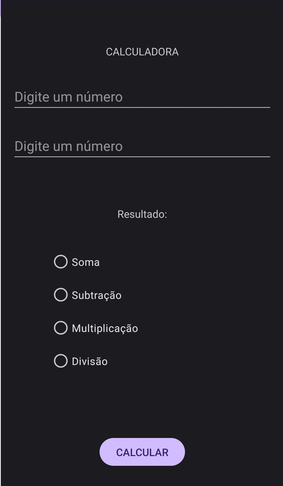
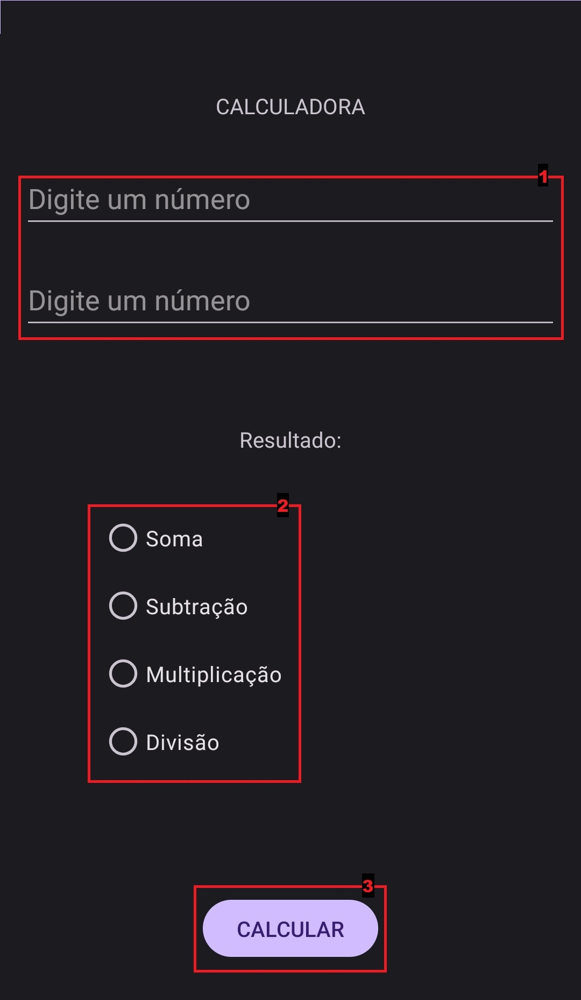
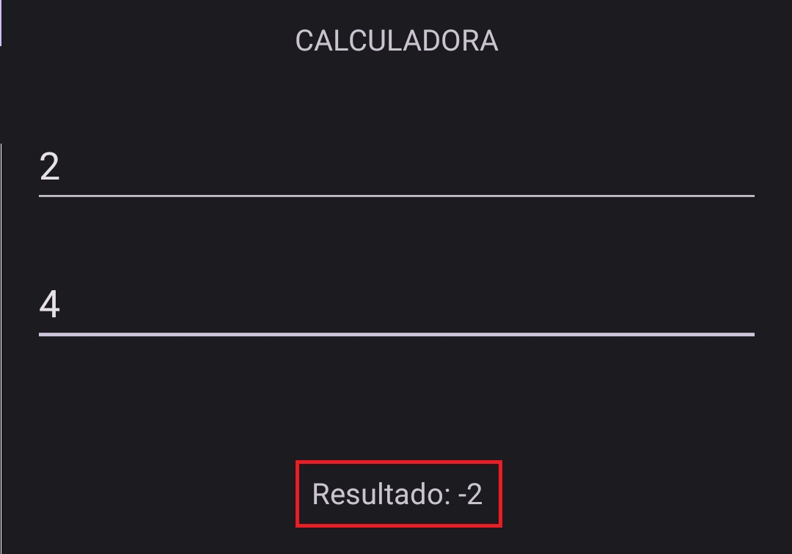

# ADO 01 - Calculadora
Calculador feita como um aplicativo para dispositivos Androide, consiste em um sistema simples para efetuar as quatro opereações basicas, maior foco em aplicar os conhecimentos vistos em aulas.

## Uso do APP
Ao abrir o aplicativo nos deparamos com a seguinte interface:

Para efetuar a operação desejada, deve se entrar com os valores nos campos superiores, e selecionar a operação a ser efetuada, e por final apertar o botão de calcular.

Após efetuar os paços a cima, o resultado da operação iria aparecer a frente do texto **Resultado:**, como mostrado na foto a baixo:

##Observações

- Ao tentar efetuar a operação de divisão por 0, sera mostrado um aviso de erro, alertando sobre a divisão.
- Os valores de resultado apresentarão vírgula apenas quando necessário.